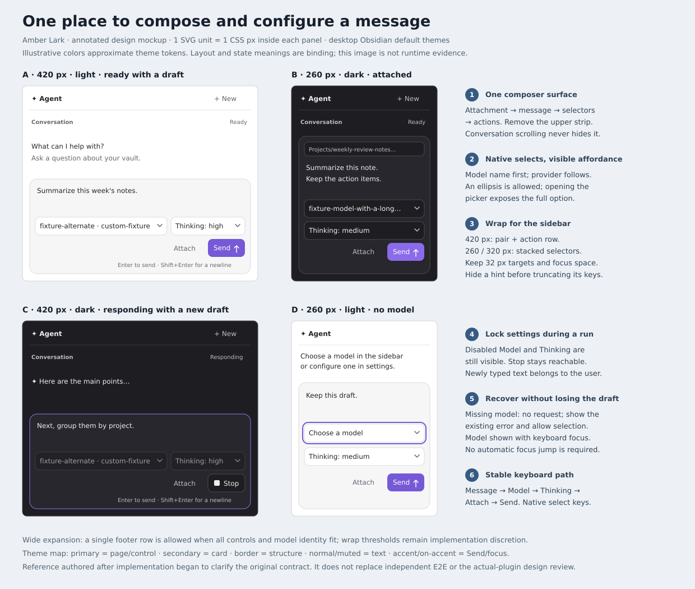
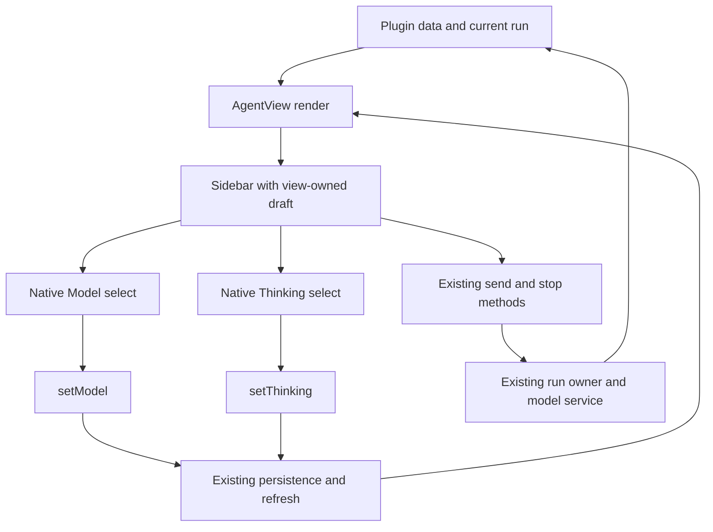

# Amber Lark: chat composer

## Outcome and assignment

Bring model and thinking selection into the message composer so users can choose how to run their next message where they write and send it. The conversation gains the space currently occupied by the separate settings strip.

Original user request, verbatim:

> commit. Then we test it: assume you are the orchestrator agent in this run. Redesign the chat bar UI and put the model/thinking selection to the chat input area (like most agent harnesses do).

The preceding commit and orchestrator clauses were fulfilled by the parent session. This plan concerns the UI redesign. Planning baseline: `c074b65f6baa3d1a19004329309465913fa9e5c9`. Worktree branch: `worktree/amber-lark-chat-composer`. Authorized endpoint: implementation, independent E2E authoring and verification, final independent review, commit, push, and PR against `main`; no merge.

Authoritative user correction:

> Check your started agent. The "reviewer" agent should be a subagent without another pane. Update the skill and write on this.

Keep the existing `reviewr` diff viewer. The implementer must spawn the independent reviewer with its subagent tools, with no inherited conversation and no additional Herdr pane, tab, or workspace. Include the corrected Land Changes skill from `/home/nvirellia/Projects/obsidian-agent/.agents/skills/land-changes/SKILL.md` in this change by syncing that one file into this worktree, preserving other work.

## Scope and production boundaries

- Change the React presentation in `src/view.tsx` and plugin-scoped styles in `styles.css`. Preserve the `AgentView` lifetime, React draft ownership, existing plugin methods, persisted data format, provider catalog, and model/thinking semantics.
- `src/main.ts` owns `setModel`, `setThinking`, `send`, attachments, persistence, cancellation, and run ownership. Reuse those boundaries. A proposal to change their semantics must return to the planner before dependent implementation or test changes.
- Keep the header, saved-chat navigation, conversation, activity, and error surfaces functional. Local spacing adjustments are allowed where removal of the upper selector strip changes the layout. Reworking these other surfaces, adding a custom searchable model picker, adding capabilities, changing provider eligibility, and changing send shortcuts are outside this change.
- Add the plan-matched test at `tests/e2e/amber-lark-chat-composer.test.ts`, with exactly one top-level `test()`. Reuse `tests/e2e/support.ts` and deterministic local model services. Do not add a unit-test suite or runtime dependency for this UI change.
- Preserve accessible names `Message`, `Model`, `Thinking`, `Attach active note`, `Send`, `Stop`, `New chat`, and `Saved chats`. Preserve the meaningful stable selectors used by existing coverage, including `.agent-composer`, `.agent-composer-card`, `.agent-tool-activity`, `.agent-error`, and saved-chat `button[data-chat-id]`.

## Design decisions

The bottom composer is one inset, rounded, theme-aware surface. Its message area is visually dominant; its compact footer contains the settings and actions that govern the next send. Remove the standalone selector strip above the conversation entirely, including its unused layout rules. Do not leave duplicated selectors elsewhere in the view.

The card reads in this order:

1. Attached-note context, when present.
2. The multiline message field.
3. Model, Thinking, Attach, and Send or Stop, in this DOM and keyboard order.

Use the existing native `select` elements, styled as compact secondary controls in the composer footer. Give the model most of the available selection width. Keep the model name readable before the provider qualifier when space truncates the closed control; full option text must still distinguish the provider and model. Keep all existing thinking values (`off`, `minimal`, `low`, `medium`, `high`, `xhigh`), with a visible indication that the value controls Thinking. Native labels can be visually hidden where the visible option already explains the control, but accessible names remain exact and stable.

Both closed selects must show a visible dropdown indicator in light and dark themes. Prefer the native indicator; a decorative, theme-aware chevron is acceptable if theme styles suppress it. Keep that decoration out of the accessibility tree and pointer hit testing. The dropdown affordance clarification follows planner review finding D1 below; it does not change selection semantics or introduce an overlay.

At a wide sidebar, the footer can fit on one line. At a narrow sidebar, put the selection pair on the first footer line and Attach and Send/Stop on the next. Stack the pair further if zoom or available width requires it. Adapt to the sidebar container, not the desktop viewport. Do not shrink controls below usable sizes or hide either selector to force a single row. The precise wrap threshold follows measured content; it is not a device breakpoint.

Use a quiet neutral treatment for settings and attachment, and the host accent for Send. Stop stays a plainly recognizable action in the same trailing action position. An icon-only Send is acceptable with the exact accessible name and a tooltip; visible Send/Stop text is also acceptable. Attach retains its accessible name even if its visible text is omitted for density. The keyboard hint is secondary; it can move beneath the card or disappear at narrow widths, without displacing controls. Where shown, explain both Enter to send and Shift+Enter for a newline.

The chosen shipped treatment may retain the current visible Attach, Send, and Stop text; it is approved and needs no conversion to icon-only controls. When the complete shortcut hint will not fit, wrap or hide it instead of truncating a key or its meaning. Model/provider and long attachment text can truncate with their existing full-value access; the shortcut instruction is different because its two clauses describe different actions.

Use Obsidian color and typography variables, the existing compact density, logical inline spacing, and a visible keyboard focus indicator. Target at least 32 CSS pixels of height for composer buttons and selects, never below a 24 by 24 CSS-pixel hit area. Maintain padding around focus outlines and distinct nonoverlapping targets. The card should carry the grouping without an extra heavy border or ornamental panel around each row. Do not add animation, a component library, or decorative assets for this change.

The conversation remains the scrollable area. The composer remains reachable while scrolling a long conversation and while opening saved chats. At desktop sidebar widths of 260, 320, and 420 CSS pixels with a normal-height window, all composer controls must remain inside the view and card, without horizontal clipping, overlap, or horizontal scrolling. Also inspect 200% app zoom in a window with at least a 640 by 480 CSS-pixel content viewport after zoom; resizing the sidebar as needed to the supported 260-pixel minimum is allowed. Taller text or a multiline draft must not cover the footer. The message field may scroll internally at its existing maximum height.

## Resolved design decisions and visual reference

The original contract remains the behavioral authority. This supplement was requested after implementation and independent E2E authoring had begun; it clarifies the handoff and reviews existing work without restarting it. Implementation steps, task breakdown, execution order, and verification scheduling belong to the implementer, subject to the repository's mandatory workflow gates.

| Decision                         | Chosen design and consequence                                                                                                                                                                                                                                                               |
| -------------------------------- | ------------------------------------------------------------------------------------------------------------------------------------------------------------------------------------------------------------------------------------------------------------------------------------------- |
| Location and hierarchy           | One bottom card contains attachment context, the message, and the settings/actions for the next send. The message remains the primary surface; removing the upper strip gives space back to the conversation.                                                                               |
| Picker interaction               | Retain native selects and visible dropdown indicators. Platform keyboard behavior and the current provider catalog remain available without a new picker state machine.                                                                                                                     |
| Displayed model                  | Show the model name before the provider, using `model name · provider`. Truncation preserves the useful leading identity; native option text contains the complete pair. Persist the same `provider::id` value as before.                                                                   |
| Thinking copy                    | Use `Thinking: off`, `Thinking: minimal`, `Thinking: low`, `Thinking: medium`, `Thinking: high`, and `Thinking: xhigh`. The readable prefix explains what the value controls; the accessible name remains `Thinking`.                                                                       |
| Density at representative widths | At 420 pixels, show the two selectors side by side and the actions beneath. At 260 and 320 pixels, stacked full-width selectors are accepted: they preserve more of the model name and keep Thinking readable. A larger sidebar can consolidate the footer onto one line when content fits. |
| Action treatment                 | Retain text and icons for Attach and Send/Stop as implemented. Neutral secondary controls and an accented Send communicate the primary action. Native disabled selectors remain visible during preparation/streaming.                                                                       |
| Draft and selection lifetime     | Drafts belong to the view; selections are global persisted defaults. Chat switching resets the draft according to the existing contract. Selection changes and stream refreshes never reset it.                                                                                             |
| Error recovery                   | Keep the existing conversation error surface and recoverable draft behavior. Selecting a model does not itself retry or send. An explicit later send uses the recovered configuration.                                                                                                      |

The [annotated mockup](composer-reference.svg) is a standalone SVG, 1240 by 1050 pixels. Its embedded sidebar panels use one SVG unit per CSS pixel: A and C are 420 pixels wide, B and D are 260 pixels wide. A shows a light-theme ready draft; B shows a dark-theme attachment with a long model name; C shows dark-theme streaming with disabled selectors and a newer draft; D shows light-theme unavailable-model recovery with keyboard focus on Model. The 320-pixel layout uses the same stacking as B/D. Surrounding host chrome is simplified; panel heights illustrate the composer and are not a new minimum-window-height requirement.

The reference approximates Obsidian's default light/dark colors; production must use host tokens rather than copy its hex values. Primary surface maps to `--background-primary`, card to `--background-secondary`, structural borders to `--background-modifier-border`, text to `--text-normal`/`--text-muted`, and Send/focus to `--interactive-accent`/`--text-on-accent`. Use `--font-interface` and existing UI type sizes. Focus must remain visible around each enabled control; a card focus border alone is insufficient.

Rendered and visually inspected by the planner with `magick -background none docs/amber-lark-chat-composer/composer-reference.svg /tmp/amber-lark-composer-reference.png`. The source contains no executable script and does not enter the production bundle. The mockup establishes intent, not a plugin test result. Exact grid thresholds, helper/component extraction, and small spacing adjustments remain implementation discretion when they preserve the hierarchy, target sizes, keyboard order, and acceptance criteria.

## Technical blueprint

| Boundary                         | Owner and inputs                                                                      | Outputs and constraints                                                                                                                                                                                                               |
| -------------------------------- | ------------------------------------------------------------------------------------- | ------------------------------------------------------------------------------------------------------------------------------------------------------------------------------------------------------------------------------------- |
| `AgentView` in `src/view.tsx`    | Obsidian `ItemView`, one React root for each open leaf                                | `render()` supplies the current plugin to `Sidebar`; `onClose()` unmounts. Relocation adds no new listener, timer, root, or lifecycle owner.                                                                                          |
| `Sidebar` message field          | React `draft`; chat identity; existing pending-submission ref                         | `setDraft` handles typing. The existing send/settle path clears an accepted draft and restores it after error only if no newer draft exists and the same chat/view still owns it. Keep this path intact.                              |
| Composer model control           | `plugin.models.getModels()` and `plugin.data.model`                                   | Derive the displayed valid selection from the catalog on render. An absent stored ID displays the placeholder, while the persisted value remains untouched until an explicit valid choice. `onChange` calls `plugin.setModel(value)`. |
| Composer thinking control        | `plugin.data.thinking`, the six existing allowed values                               | `onChange` calls `plugin.setThinking(value)`. No duplicated React selection state, per-chat override, or new provider capability logic.                                                                                               |
| Both setting controls            | `plugin.isStreaming()`                                                                | Use native `disabled` from preparation through completion/cancellation. Both plugin setters retain their own run guard. Re-enabling follows plugin state refresh.                                                                     |
| Attach and send actions          | Existing `attachActiveNote()`, `send(message)`, and `stop()` methods in `src/main.ts` | Attachment content comes from the existing Vault/editor boundary and is consumed by the next accepted send. `send` captures selected model and thinking for that run; `stop` retains ownership/cancellation behavior.                 |
| Error and conversation rendering | Existing message, partial text, interrupted text, activity, and error fields          | Text stays text; no new HTML rendering or error bus. The composer is a sibling of the scrolling conversation, not a descendant of the log.                                                                                            |
| Layout in `styles.css`           | The composer card's inline size and host theme tokens                                 | Native controls remain in logical DOM order. Grid wrapping adjusts their rows, never their semantics. Remove unused upper-strip selectors; retain stable meaningful classes for the tests.                                            |
| Persistence and model requests   | Existing `src/data.ts`, `src/models.ts`, and `src/main.ts` contracts                  | No schema migration, new request format, changed provider routing, or new persisted UI state. Source review must confirm these boundaries remain unchanged.                                                                           |

The diagram describes data ownership, not an implementation sequence. For this presentation change, wrappers such as `.agent-composer-footer`, `.agent-composer-field`, and `.agent-composer-actions` may organize markup without creating components with their own state. A fresh independent reviewer must still check that generated tests observe the real packaged plugin rather than merely these wrappers.

## Worked examples and state outcomes

| Starting state and input                                                                          | Expected observable output and invariant                                                                                                                                                                                                                 |
| ------------------------------------------------------------------------------------------------- | -------------------------------------------------------------------------------------------------------------------------------------------------------------------------------------------------------------------------------------------------------- |
| Idle; draft `Summarize this week's notes.`; choose `custom-fixture::fixture-alternate` and `high` | Draft remains exact. Model reads `fixture-alternate · custom-fixture`; Thinking reads `Thinking: high`. Saved values become the selected ID and `high`. Selection alone makes no model request. Explicit Send routes the request to `fixture-alternate`. |
| Persisted model `custom-fixture::missing-model`; draft `Keep this draft.`; press Enter            | Model shows `Choose a model`; request count remains zero; the existing selection/configuration error appears; draft remains exact. Choosing an available model still makes no request. Sending again starts one request.                                 |
| Idle; enter `Line one`, Shift+Enter, `Line two`                                                   | Draft becomes `Line one\nLine two`. Shift+Enter makes no request. A later Enter submits the multiline content once. Native IME composition Enter is excluded from submission.                                                                            |
| Send `Summarize this note.` with a Markdown attachment                                            | The attachment path was visible above the field before sending. The request includes its note/selection content. The attachment is consumed; the accepted draft clears once. Attachment consumption is not delayed until the response completes.         |
| Response is held after partial text; user types `Next, group them by project.`                    | Model and Thinking are disabled; Stop is reachable; the new text remains editable. Completion or Stop restores idle controls while retaining the newer draft. A late canceled completion cannot replace it or the active chat.                           |
| Submitted text is `Retry this summary.` and the model service fails                               | If the draft is empty, it becomes `Retry this summary.` again. If the user already typed `Use a shorter answer.`, that newer text wins. Error, restored selectors, and Send are visible. No automatic retry occurs.                                      |
| Sidebar is 260 pixels with a long model identifier and long note path                             | Model text begins with its name, native options expose its full identity, the attachment remains within the card, selectors stack, and action targets remain separate. The conversation scrolls independently.                                           |
| Close/reopen or reload after selecting alternate model/high                                       | One Model and one Thinking control restore the persisted values. The unsent draft may reset. Stopped persisted output remains according to the existing run contract.                                                                                    |

These examples make the contract concrete; they are not a generated oracle or a replacement for independent E2E derivation. Invariants across them are one displayed selector of each kind, no selection-triggered send, no layout-driven state changes, no active-run reconfiguration, and no loss of a newer draft to a refresh or stale completion.

## Behavioral contract and acceptance criteria

| ID   | Trigger or precondition                                                                                       | Required observable result                                                                                                                                                                                                                                                                                                                                                             |
| ---- | ------------------------------------------------------------------------------------------------------------- | -------------------------------------------------------------------------------------------------------------------------------------------------------------------------------------------------------------------------------------------------------------------------------------------------------------------------------------------------------------------------------------- |
| AC1  | Open an idle chat with a configured model                                                                     | Exactly one Model and one Thinking combobox are inside the same `.agent-composer-card` as Message. Both appear below the message field, outside the conversation log. No selector strip remains above the conversation. The current model and thinking level are visible.                                                                                                              |
| AC2  | Type an unsent draft, then change Model and Thinking from the composer                                        | The draft is unchanged. Both selections persist through `savedData()`, sidebar close/reopen, and app reload. A subsequent request uses the selected model. Thinking retains its existing plugin meaning and is passed through the existing `thinkingLevel` boundary, with no new UI-only selection state. Selections are global defaults for subsequent sends, not per-chat overrides. |
| AC3  | Idle message is empty, whitespace-only, multiline, or being composed with an IME                              | Empty/whitespace submissions make no model request. Preserve the existing disabled Send behavior for blank drafts. Enter sends a nonblank draft once; Shift+Enter inserts a newline; Enter while native `isComposing` is true does not send. Selection-key handling never submits the draft.                                                                                           |
| AC4  | Submit a valid draft and hold the response in the deterministic service                                       | The accepted draft clears once. Stop occupies the send action position. Model and Thinking are natively disabled for the entire run, including preparation. A user may type the next draft during the run; streaming updates and completion preserve it. On completion, Send and enabled selectors return.                                                                             |
| AC5  | No selected model, or the persisted selected model is absent from the catalog                                 | The Model control shows `Choose a model` instead of suggesting a valid selection. Submitting a nonblank draft makes no model request, shows the existing actionable model-selection error, and preserves the draft. Selecting a valid model makes a later send work. Do not auto-select another model or drop unavailable persisted IDs silently.                                      |
| AC6  | The model service fails after a send                                                                          | The error remains visible. Selectors become usable again. Restore the submitted text if the composer is still empty; preserve a newer draft instead of overwriting it. Changing a selection during recovery remains possible.                                                                                                                                                          |
| AC7  | Attach an active Markdown note, or invoke Attach with no eligible note                                        | The note path appears above Message inside the composer, and a later send includes its content. A long path cannot widen the card or cover controls. No eligible note produces the existing error without losing the draft. The attachment action retains the existing selection-versus-note behavior.                                                                                 |
| AC8  | Stop a held response, switch chats during a response, or receive a late old completion                        | Stop ends the current run, retains its partial reply/interruption according to the existing contract, and restores usable selectors and Send. New chat and saved-chat switching retain their cancellation semantics. Late output must not overwrite the active chat or its new draft. Persisted interrupted output remains after reopen/reload.                                        |
| AC9  | Use the composer at 260, 320, and 420 pixels, with a long model name, an attachment, and a multiline draft    | All controls are visible and operable within the card and view; their rectangles do not overlap. The model remains identifiable and full provider/model option text is available through the native picker. The footer wraps instead of forcing the user to horizontally scroll. The composer remains reachable while the conversation scrolls and the saved-chat panel is open.       |
| AC10 | Navigate the idle composer using only the keyboard; inspect both Obsidian light and dark themes and 200% zoom | Tab order follows Message, Model, Thinking, Attach, Send. Native keyboard selection works without losing or sending the draft. Every enabled control has an accessible name and visible focus. Labels, selected values, and actions remain readable and reachable. The rendered colors follow the host theme. New styling preserves reduced-motion and forced-colors support.          |
| AC11 | Close/reopen the view and reload the packaged plugin                                                          | One instance of each composer control is present; one user action produces one action/request. No duplicate UI handlers appear. Model and Thinking restore from persisted state. Unsent draft persistence across view close/reload is not required.                                                                                                                                    |

## Independent testcase design and verification

Before plugin source edits, the implementer must give a fresh subagent with no inherited conversation this plan, the E2E Testing and QA Methodology skills, and the existing harness. The subagent authors actual E2E code and derives expected outcomes from the acceptance table. It may use existing tests to understand fixture mechanics, but their assertions do not replace this contract. Wait for that test artifact before implementing. Record the author identity, context boundary, and plan revision used. If the test reveals an unclear requirement, ask this planner to resolve it before encoding an assumption.

Use equivalence partitions for valid/unselected/unavailable model values, blank/nonblank drafts, and normal/long labels. Use layout boundaries at the three specified widths and transition cases for idle, preparing/streaming, completion, failure, Stop, and reload. Test placement with both ancestry and rendered geometry: moving invisible duplicate controls into a wrapper must not pass. Assert meaningful effects such as saved values and captured requests, not only event handlers or CSS class names. A pre-implementation placement check that fails against the baseline supplies a useful negative control; record it as an expected failure rather than a passing suite.

The new scenario must directly cover AC1, AC2, AC5 recovery, and AC9; it must also exercise keyboard navigation/selection, one held response followed by Stop, draft survival, and control uniqueness after reload. Include a long fixture model label using seeded custom endpoint data. Native option text and keyboard access can establish availability of its full identity; a hover-only tooltip is insufficient. A synthetic IME `isComposing` event can supplement real keyboard actions if the harness has no input method, but record that limitation.

Reuse the existing `swift-heron-react-chat-sidebar` scenario for the detailed Enter/Shift+Enter, error recovery, attachment, cancellation, late completion, themes, and reopen regressions. Reuse `steady-falcon-formal-verification` for preparation/ownership boundaries and interrupted-state restoration. `bright-otter-initial-plan` and `calm-badger-codex-oauth` also remain required regressions. The final record must map every AC to an executed test or an explicit independent visual observation; a pre-existing test name alone is not evidence.

Required verification evidence (the implementer owns its execution sequence within the repository's gates):

1. **Checks:** run `pnpm check` in the pinned devenv environment, including formatting, lint, TypeScript, ActionLint, and existing Lean/fixture freshness checks. Build with `pnpm build`; inspect nonempty packaged `main.js`, `manifest.json`, and `styles.css` at the plugin root.
2. **Tests:** run `pnpm test`, which includes tooling and all plan-matched E2E files. Exercise only the packaged plugin in disposable vaults and the existing isolated compositor/Bubblewrap harness. Do not weaken isolation or substitute a source-only test.
3. **Visual Test:** the paid `pnpm vision` lane remains advisory and is not an additional delivery gate. Independently required for this UI task is a manual computer-use pass under the Obsidian Computer Use skill after Checks and Tests: inspect real screenshots, operate the selectors and send a message, verify light/dark and narrow layouts, focus, and 200% zoom. Keep representative screenshots outside disposable profiles before cleanup. A screen-reader pass is useful when available; distinguish an accessibility-tree/keyboard check from an actual screen-reader test.
4. **Independent final review:** the implementer spawns a fresh reviewer subagent with no inherited conversation through its subagent tools. Supply the original request and corrections, this current written plan, the diff/revision, independently authored tests, observed UI, and actual verification evidence. Findings return through the subagent channel to the implementer, who coordinates contract questions with the planner. Do not create a Herdr pane, tab, or workspace for review or replace the right-hand diff viewer. Resolve all material acceptance mismatches before delivery; unavailable subagent review remains pending.

The planner separately reviews the implemented behavior, architecture, and visual result against this design using the actual revision and plugin screenshots or running-plugin evidence. That design review and its corrections are recorded below. It supplements the fresh final reviewer subagent and does not replace it.

Formatting fixes and review fixes require the affected Checks/Tests to pass again. Record the checked commit or working-tree baseline plus diff identity, commands, outcomes, evidence paths, skipped optional checks, and remaining external assumptions. Required unavailable checks remain pending.

## Lean applicability and assumptions

No new Lean source or executable model is applicable. This change relocates native controls and adjusts browser layout, while the consequential run ownership, persistence, and cancellation definitions stay unchanged. A proof over element ancestry or pixel boxes would not establish React/Obsidian rendering or native-select behavior. The existing steady-falcon model and fixture checks remain part of `pnpm check`; their proofs are not new evidence that this composer is correct. Packaged E2E and independent visual inspection establish sampled implementation agreement for this change.

Counterexamples considered during planning: a long model name forcing Send outside the card; a narrow desktop sidebar missed by a viewport media query; a selection refresh erasing the draft; an enabled picker modifying an active run; duplicate selectors left in the header; a stopped response overwriting a new draft; and model text that appears selected while its catalog entry is missing. The ACs above reject these cases without introducing a new state machine.

Assume successful Obsidian settings persistence and browser-native select semantics in the pinned desktop runtime. Deterministic local fixtures establish request routing and UI behavior, not external provider availability, provider-specific reasoning support, mobile behavior, or every community theme. Use installed APIs and existing lifecycle cleanup; no new vault access is needed. If implementation crosses these boundaries, reassess Lean applicability with the planner.

## Coordination and planning evidence

- Planner: `amber-lark-plan`, Herdr pane `wM:p1` in workspace `wM`, tab `wM:t1`. Contact directly for contract changes; do not report to the orchestrator.
- Implementer: `amber-lark-impl`, pane `wM:p3` below `wM:p1`, in this same tab/worktree, through `ocsh -m deepseek-v4.1-flash`. Its assignment includes delivery ownership. Shell readiness was verified after devenv finished loading. Herdr then detected the idle agent and the terminal showed DeepSeek V4.1 Flash. After rename and prompt delivery, Herdr reported `working` and the agent began reading this plan and the required skills. Layout inspection confirmed the implementer below the planner, the existing viewer on the right, and focus still on `wM:p1`.
- Existing right-hand pane: `wM:p2`, label `reviewr`. Inspection showed it runs `herdr-reviewr`, a diff viewer, and is not a promptable coding agent (`herdr agent get wM:p2` returned `agent_not_found`). The user explicitly confirmed preserving this viewer and using a fresh reviewer subagent without another pane. This supersedes the earlier routing question and fallback. Record the reviewer subagent's identity and final verdict here. Findings return to the implementer; neither reviewer nor implementer reports to the orchestrator.
- On receipt of the correction, the planner inspected `amber-lark-impl`: it was working, had started the independent `/root/amber_lark_test_author` subagent, and was studying existing source while awaiting test code. No new reviewer pane was opened. The planner read the corrected skill in the primary checkout and relayed the correction and one-file sync instruction directly to the implementer.
- Planning reviewed `AGENTS.md`, Land Changes, Obsidian Plugin Development, E2E Testing, QA test-design/provenance references, Lean Verification and target guidance, interface layout/accessibility guidance, `src/view.tsx`, the relevant `src/main.ts` boundaries, `styles.css`, existing plans and sidebar E2E coverage, the fixture interfaces, package scripts, manifest, and development guide.
- README instructions already say to choose a model in the sidebar and remain accurate. No repository guidance or README change is required by this presentation-only scope; use Update Project Docs if implementation creates a stale claim.
- Planning evidence does not claim a UI build, E2E pass, visual inspection, or independent final approval. Those stages are pending below.
- The pinned shell supplies Node.js `v24.20.0` and pnpm `11.25.0`. `pnpm install --frozen-lockfile` succeeded using the existing package store after sandboxed pnpm initially could not open its store database; no lockfile change was needed. `pnpm exec prettier --check docs/amber-lark-chat-composer/amber-lark-chat-composer.md` passed. `git diff --check` passed for tracked changes; the new plan is still untracked and its whitespace/formatting is covered by Prettier. No plugin code was changed during planning.

## Planner design review

Initial review on 2026-09-25 of the uncommitted implementation based on `c074b65f6baa3d1a19004329309465913fa9e5c9`. Review artifacts identify the version inspected:

- `src/view.tsx` SHA-256: `c7979840d7ff709b25363f3564f7def05bec7884eea52178895b716634822f83`.
- `styles.css` SHA-256: `80649f61292e1266aa9d04adda5108f03a33bcd19a8cb37a794022e0ae830bb4`.
- Bundled `main.js` SHA-256: `c160a727f8aa299072fc18fa29ac8b289d35e014a6535e28d0dfc7eb875ed3a7`.
- Independent test source SHA-256: `d6febfda5aca446b348f6bce2f9f2635de99c8039279cade80d94b048f059f29`.

The planner viewed actual-plugin screenshots `/tmp/obsidian-computer-use-LTmvr2/0012.png`, `0021.png`, `0025.png`, and `0029.png`, with the run's input transcript. These show Thinking keyboard focus/selection with a retained draft, the 420-pixel light layout after a response, and the 260-pixel light and dark layouts. The planner also viewed `/tmp/obsidian-computer-use-Ha0eqF/0013.png` and confirmed that run's copied `main.js` and `styles.css` hashes match the versions above. The SVG mockup was separately rendered and viewed; it is not included as implementation evidence.

| Area                    | Finding and verdict                                                                                                                                                                                                                                                                                                                                                                  |
| ----------------------- | ------------------------------------------------------------------------------------------------------------------------------------------------------------------------------------------------------------------------------------------------------------------------------------------------------------------------------------------------------------------------------------ |
| Architecture            | Matches the blueprint: source diff relocates the two native selects and their existing handlers; `src/main.ts`, `src/data.ts`, and `src/models.ts` are unchanged. No new persisted state or lifecycle resource was introduced.                                                                                                                                                       |
| Placement and hierarchy | Observed pass at the viewed widths: selectors are in the card below the message, the upper strip is removed, Model leads Thinking, and the footer stays separate from conversation content. Stacking at 260/320 is an accepted readability tradeoff.                                                                                                                                 |
| Keyboard and theme      | Viewed Thinking focus is visible, its chosen value changes while the typed draft remains, and the card/controls adapt to the light/dark screenshots. Full keyboard, contrast, and screen-reader claims require their recorded checks; these images alone do not establish all accessibility behavior.                                                                                |
| D1: dropdown affordance | Correction required: neither closed selector shows a visible dropdown indicator in the reviewed 420- and 260-pixel screenshots. Restore the native indicator or add a decorative theme-aware chevron while preserving the native control and keyboard semantics. Recheck both themes after the change. Sent directly to the implementer for correction and test-author coordination. |
| Remaining evidence      | At this review point, actual held/disabled and long-attachment screenshots and verified 200% app zoom have not been supplied to the planner. Zoom keystrokes alone do not establish a changed zoom level. Keep these pending until actual evidence is reviewed. These are evidence gaps, not observed production failures.                                                           |

Follow-up inspection on the same date:

- The implementer added an empty decorative CSS chevron with `pointer-events: none`, theme token color, and native selects preserved. Positioning and text padding use logical inline properties. Current `styles.css` SHA-256 is `f4cc69c91845d1e70c36e01bff275425210a6dd370476cda9ea9a96368228c9f`; `src/view.tsx` and `main.js` retain the hashes above.
- The planner viewed `/tmp/obsidian-computer-use-Dojfyk/0005.png` and `0013.png` and verified that the run's packaged CSS and bundle match the checkout. D1 is visibly fixed at 420 and 260 pixels in light mode. Although the transcript attempted a dark-theme command, `0013.png` is visibly still light; it cannot close the dark-theme requirement. This evidence mismatch was sent directly to the implementer.
- The planner viewed `/tmp/amber-lark-evidence-3Na1yO/0007.png`, `0009.png`, and `0011.png`. They show a contained long attachment above the draft, a long model name with a visible chevron, and a held partial response with disabled selectors, consumed attachment, and Stop in the send position. This run precedes only the logical-positioning CSS adjustment; the long-content and run-state behavior match the blueprint.
- The available earlier Checks and regression logs were inspected as supporting context. They do not certify later CSS changes; the implementer owns the final verification record and reruns appropriate to the correction.

Manifest review on the same date:

- The implementer supplied tracked-diff SHA-256 `e7298abc34e860c5763a0f2e4f4dff746f5b1c05affb25252c6afa6a7d01b658` for the working tree above the same HEAD. Planning-document edits can subsequently change that aggregate identity. The planner independently confirmed the source/CSS hashes above, updated independent test SHA-256 `5f864887babce837c73e13324bbb25b4ee9837f3f8a72dc7eae2831a7524528c`, and packaged `main.js` MD5 `9d17e88e050865d18093e6f93dfcd3e4`.
- The planner viewed `/tmp/amber-lark-evidence-G6ZhBT/0005.png` and `0007.png`, showing actual dark mode at 420 and 260 pixels. Both native selectors display the corrected chevron; long model text truncates within the control. The earlier light captures and these dark captures close D1. No further production correction is requested by the planner at this point.
- The planner inspected `/tmp/amber-lark-final-check.log` and `/tmp/amber-lark-final-test.log`: Checks reports format, lint, both type projects, ActionLint, and Lean success (63 audited theorem declarations, 20 fresh model cases); Tests reports all five E2E scenarios passing. The implementer's manifest reports the associated exit-zero commands and all eight tooling tests passing. This is reviewed evidence from the implementer, not an independently rerun suite.
- The raw `/tmp/amber-lark-evidence-1UmXc5/transcript.jsonl` establishes Electron zoom factor 2 and a 640 by 500 CSS-pixel viewport. Its 250 by 255 rectangle is a padded screenshot crop around `.agent-composer`, not the exact composer or individual-control bounds. The planner viewed the supplied `/tmp/obsidian-computer-use-Un7xe6/0003.png` and `0005.png`; they are earlier unzoomed captures at an equivalent smaller viewport and predate D1. They support reflow inspection but do not complete actual-zoom visual verification.
- The implementer was asked for one readable capture of the final packaged composer at actual 200% zoom, with the raw zoom/viewport and package identities retained, and confirmation that the composer controls remain visible and operable. Trying device-scale capture instead of the scratch helper's hard-coded CSS-scale capture is a proposed capture-method fix, not new production scope. Unsuccessful theme/zoom capture attempts remain inconclusive rather than passing evidence.

Final actual-zoom review on 2026-09-25:

- The planner viewed `/tmp/zoom-200-full.png` at its original 1280 by 1000 resolution and `/tmp/zoom-200-composer.png`. These are captures of the isolated compositor output containing the actual zoomed app, replacing the incomplete page captures as visual evidence. The implementer records the same-session zoom factor as 2, the CSS viewport as 640 by 500, and exactly one composer card, with a 260-pixel sidebar.
- The final image visibly shows the message field, long model value and chevron, `Thinking: high` and chevron, Attach, the correctly disabled Send for the empty draft, and the complete shortcut hint. The controls are distinct and inside the card and viewport. The conversation remains separately scrollable. This satisfies the plan's visual/reflow check at actual 200% zoom. Existing packaged keyboard and request tests supply the interaction evidence; this still image is not claimed to prove interaction by itself.
- Image SHA-256 values: full output `b5e3ccddbd12c04c346d99ce250e761fcc5ea498045c513e6032d8fdad8cb3ab`; composer crop `10e0212faa39eb0d81a04cfaf11f956170d616962815531a2a294993736eabb5`. The planner rechecked `src/view.tsx`, `styles.css`, the independent E2E file, and `main.js`; all still match the supplied final manifest identities above.
- Zoom was applied through the runtime zoom API as a test condition. This verifies the composer under that condition, not the user's zoom shortcut or an Obsidian zoom-settings flow. Earlier failed theme commands and incomplete page captures remain inconclusive. No claim is added for real providers, every community theme, mobile, an actual IME, or a screen reader.

**Final planner design verdict: APPROVE.** The implemented behavior, architecture, and inspected visual states match this design. D1 and the actual-zoom evidence gap are closed; no planner corrections remain for the recorded source/CSS/bundle identities. This approval supplements the separately required fresh independent reviewer subagent and does not replace its review or the implementer's delivery gates. Material later changes to these design boundaries require reassessment of the affected evidence.

Scoped reassessment after independent review, 2026-09-25: **APPROVE the wrapping shortcut hint.** The only production change since the approved design is `.agent-composer-hint`: remove `white-space: nowrap`, `overflow: hidden`, and `text-overflow: ellipsis`; add `text-align: end` and `line-height: 1.4`. The hint retains `grid-column: 1 / -1`, `justify-self: end`, and `max-width: 100%`, so it stays below the actions and may grow vertically in its own automatic grid row. This implements the existing design requirement to wrap or hide the complete shortcut instruction instead of truncating a key or its meaning. There is no change to a control, state boundary, keyboard handler, or model request.

The planner inspected the updated rule and confirmed current `styles.css` SHA-256 `11a97c8ffc0227145da997ea8cb0564eee0ad380bbc89cd5dca05e4173bccba4`; `src/view.tsx` and the independent E2E file still match the final manifest. The planner also inspected `/tmp/amber-lark-final2-check.log` and `/tmp/amber-lark-final2-test.log`, which show passing Checks and all five E2E scenarios after this change; the implementer reports exit zero and eight passing tooling tests. The packaged layout scenario rechecks card/control containment at the supported widths, although it does not directly assert the hint's text wrapping. This targeted approval rests on the source change, prior inspected UI, and those rerun layout checks; it does not claim a newly viewed planner screenshot. The implementer retains ownership of its final visual recheck and delivery record. No further planner correction is required for this CSS identity.

## Implementation and delivery evidence

Implementer: `amber-lark-impl`, Herdr pane `wM:p3`. Reviewed revision: `c074b65f6baa3d1a19004329309465913fa9e5c9` plus the working-tree change; working-tree diff SHA-256 `e7298abc34e860c5763a0f2e4f4dff746f5b1c05affb25252c6afa6a7d01b658`.

Implementation sequence chosen by the implementer (design and gates preserved, order owns by this role):

1. Independent E2E authoring before any plugin-source edit, by a fresh subagent with no inherited conversation (`amber_lark_test_author`). Its artifact is `tests/e2e/amber-lark-chat-composer.test.ts` and it failed against the pristine baseline with `The Model select is not inside the composer card.` (negative control kept at `/tmp/obsidian-agent-e2e-6eYMi4`).
2. One-card composer in `src/view.tsx`: removal of the upper selector strip; `Message`, then `Model`, `Thinking`, `Attach`, and `Send`/`Stop` inside `.agent-composer-card`; model option text leads with the model name and then the provider; thinking options carry a visible `Thinking:` prefix. No change to `src/main.ts`, `src/data.ts`, or `src/models.ts`.
3. `styles.css`: card-scoped container queries (`>459px` pair and actions on one row; `360–459px` pair row plus actions row; `<360px` stacked pair), 32 CSS-pixel controls, inline logical spacing, accent Send, and the D1 chevron affordance.
4. D1 correction after the planner design review: native selects kept, `appearance: none`, theme-aware chevron from `.agent-composer-field::after` using `var(--text-muted)`, positioned with `inset-block-start`/`inset-inline-end` and matched by `padding-inline: 8px 22px`.
5. Test-defect repair by a second fresh independent subagent (`amber_lark_test_repair`): the second `withAgent` block asserted the default fixture reply text `Fixture reply.` while using the harness default handler (`Hello from the fixture.`). The author of the test authored its own repairable fix by adding the block's `modelHandler`; no assertion was weakened.

Acceptance mapping on the final revision:

| AC                                       | Evidence                                                                                                                                                                                                                                                                                                                                                                                             |
| ---------------------------------------- | ---------------------------------------------------------------------------------------------------------------------------------------------------------------------------------------------------------------------------------------------------------------------------------------------------------------------------------------------------------------------------------------------------- |
| AC1, AC2, AC3, AC5, AC7, AC9, AC10, AC11 | `tests/e2e/amber-lark-chat-composer.test.ts` (packaged plugin, disposable vault, deterministic fixture): ancestry and geometry, draft survival, persistence through close/reopen and reload, keyboard order and native selection, blank/whitespace/IME paths, unavailable-model recovery, long model and long attachment at 420/320/260 px, saved-panel and scroll layout, one action to one request |
| AC4, AC6, AC8                            | Same scenario plus `swift-heron-react-chat-sidebar.test.ts` (held stream, disabled selectors, Stop, late completion, interrupted retention, error recovery) and `steady-falcon-formal-verification.test.ts` (preparation/ownership boundaries)                                                                                                                                                       |
| AC10 themes, focus, narrow, zoom         | Manual computer-use pass below                                                                                                                                                                                                                                                                                                                                                                       |

Commands on the final revision (pinned devenv, Node v24.20.0, pnpm 11.25.0): `pnpm check` exit 0 (Prettier, ESLint, both `tsc --noEmit` projects, actionlint, Lean with 63 axiom-audited theorems and 20 model cases); `pnpm build` exit 0 with nonempty `main.js`, `manifest.json`, `styles.css` at the plugin root; `pnpm test` exit 0 with tooling 8/8 and E2E 5/5 (new composer scenario 7.7 s, swift-heron, steady-falcon, bright-otter, calm-badger). Logs: `/tmp/amber-lark-final-check.log`, `/tmp/amber-lark-final-test.log`.

Manual computer-use pass (isolated vault/profile per session; screenshots retained outside disposable profiles):

- Light: `/tmp/obsidian-computer-use-LTmvr2/` (default 300 px, 420, 320, 260 px, keyboard focus walk Message→Model→Thinking→Attach→Send, ArrowDown selection change with the draft intact, Enter send, reload persistence, dark-mode card) and post-D1 light at `/tmp/obsidian-computer-use-Dojfyk/0005.png` (420) and `0007.png` (260).
- Dark after D1 (vault seeded `appearance.json` theme `obsidian`): `/tmp/amber-lark-evidence-G6ZhBT/0005.png` (420) and `0007.png` (260); crops `/tmp/d1-dark420.png`, `/tmp/d1-dark260.png`.
- Long model, long attachment, held/disabled run: `/tmp/amber-lark-evidence-3Na1yO/0007.png` (attached long note above the field, card not widened), `0009.png` (draft), `0011.png` (held response with Stop in the send position and both selectors disabled).
- 200% app zoom: factor 2 applied with the app zoom API (`webFrame.setZoomFactor(2)`) and confirmed as `getZoomFactor() === 2` with a 640×500 CSS viewport (meets the 640×480 requirement) and exactly one composer card. Readable final capture through the isolated compositor, because page screenshots at that zoom render only a fraction of the viewport: `/tmp/zoom-200-full.png` (1280×1000 whole output, 260 px sidebar) and the composer crop `/tmp/zoom-200-composer.png`; Message, Model (long id truncated with the chevron), Thinking: high, Attach, disabled Send, and the hint are all visible inside the card. Earlier screenshots that did not contain the composer are inconclusive and are not counted as zoom evidence.
- Harness limitations recorded: page screenshots at zoom ≠ 1 render only the top-left fraction of the device space, so zoom captures use the compositor; runtime-API zoom is fixture-state verification, not a test of the zoom shortcut itself, and it supplements rather than replaces packaged interaction evidence; the earlier light-theme capture `/tmp/obsidian-computer-use-Dojfyk/0013.png` stayed light despite a theme command and is not counted as dark evidence (dark evidence is `/tmp/amber-lark-evidence-G6ZhBT/0005.png` and `0007.png`); IME is a synthetic `isComposing` event; forced-colors has no dedicated rule or emulated run in this revision, and reduced-motion is covered only by the existing `prefers-reduced-motion` block. The authored scenario also uses explicit tolerances: 31.5 px as the control-height floor for the 32 px design value, 80 px as the Model minimum, and ±1 px containment slack.
- Reviewer-fix note: the low-severity finding that `.agent-composer-hint` could truncate a shortcut key was fixed after review by letting the hint wrap (`text-align: end`, `line-height: 1.4`, no `nowrap`/`overflow: hidden`/`ellipsis`). Re-run after the change: `pnpm check` exit 0 and `pnpm test` exit 0 (tooling 8/8, E2E 5/5) — logs `/tmp/amber-lark-final2-check.log` and `/tmp/amber-lark-final2-test.log` — plus a 260 px visual recheck where the hint still shows `Enter to send · Shift+Enter for a newline` in full with both selectors keeping their chevrons and no overlap (`/tmp/obsidian-computer-use-Z0GKfF/0005.png`, crop `/tmp/hint-fix-260.png`). Committed identities for this variant: `styles.css` SHA-256 `11a97c8ffc0227145da997ea8cb0564eee0ad380bbc89cd5dca05e4173bccba4`, `src/view.tsx` SHA-256 `c7979840d7ff709b25363f3564f7def05bec7884eea52178895b716634822f83`, test file SHA-256 `5f864887babce837c73e13324bbb25b4ee9837f3f8a72dc7eae2831a7524528c`; the earlier `f4cc69c9…` styles hash in this section is the pre-fix revision. The planner recorded a scoped reassessment approving the wrapping hint against `11a97c8f…`.
- Reviewer logs from the independent review: `/tmp/reviewer-check.log`, `/tmp/reviewer-test.log`, `/tmp/reviewer-composer-run.log`; the reviewer's archived pristine baseline lives at `/tmp/amber-baseline-review`.

Planner design review: **approved** for the recorded final view/CSS/test/bundle identities, including D1 in light and dark and the actual-200%-zoom capture; the planner's full verdict, screenshot identities, evidence scope and limitations are recorded in its own design-review section above. No planner corrections remain at this revision.

Independent review: **passed with no blocking findings** by the fresh reviewer subagent `amber_lark_review` (no inherited conversation, no Herdr pane). It independently re-ran `pnpm check` and `pnpm test` outside the sandbox (tooling 8/8, E2E 5/5), reproduced the baseline negative control in an archived pristine copy (the scenario fails there with `The Model select is not inside the composer card.`), confirmed all recorded hashes, and reviewed the contract, architecture, visual evidence and theme/zoom captures. Its four non-blocking notes are recorded in the evidence section above: hint truncation risk (fixed in the commit), inaccurate forced-colors wording (corrected), explicit test tolerances (now stated), and a coverage note that AC2's `thinkingLevel` leg rests on source review plus `savedData()` assertions because the fixture request does not carry the level. Logs: `/tmp/reviewer-check.log`, `/tmp/reviewer-test.log`, `/tmp/reviewer-composer-run.log`.

Delivery record: implementation commit `0d8065a` (`ui: move model and thinking selection into the chat composer`) on branch `worktree/amber-lark-chat-composer`, pushed to `origin`; pull request https://github.com/AsterisMono/obsidian-agent/pull/5 against `main`, opened without merging. This commit carries the plan, the design reference, the independently authored scenario, the synced Land Changes skill, and the AGENTS/README revision markers. This plan section owns the verification record, not the planner, and no reports are sent to the orchestrator.
